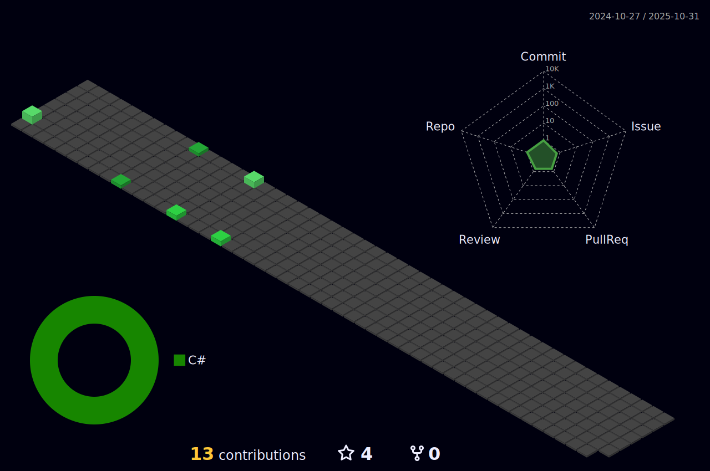

<h1 align="center">Hi 👋, I'm Jędrzej</h1>

## **🛠️ Skills**

#### **Tools and Technologies**

 

### **💻 Projects**

| [MyBike](https://github.com/KielpinskiJ/MyBike-landing) | [ToDoApp](https://github.com/KielpinskiJ/todo-app) | [NiceGadgets](https://github.com/fe-feb20-codewizards/product_catalog) |
| ----------- | ----------- | ----------- |
|  |  |  |

## **📜 Stats**
 

 

